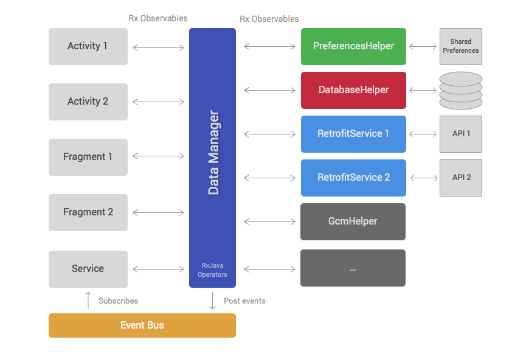

# Architecture Guidelines

The architecture of our Android apps is structured in two layers. 

* __UI Layer__: this is where Activities, Fragments and other standard Android components live. It's responsible for displaying the data received from the data layer to the user as well as handling its interactions and inputs (click listeners, etc).

* __Data Layer__: this is responsible for retrieving, saving, caching and massaging data so it is provided to the UI layer in its optimal form to be displayed. It can communicate with local databases and other data stores as well as with restful APIs or third party SDKs. It is divided in two parts: a group of helpers and a `DataManager`. The number of helpers vary between project and each of them has a very specific function, e.g. talking to an API or saving data in `SharedPreferences`. The `DataManager` combines and transforms the outputs from different helper using Rx operators so it can provide meaningful data to the UI layer. 

Looking at the diagram from right to left: 

* __Helpers (Data layer)__: A set of classes, each of them with a very specific responsibility. Their function can range from talking to APIs or a database to implementing some specific business logic. Every project will have different helpers but the most common ones are:
	- __DatabaseHelper__: It handles inserting, updating and retrieving data from a local SQLite database. Its methods return Rx Observables that emit plain java objects (models)	
	- __PreferencesHelper__: It saves and gets data from `SharedPreferences`, it can return Observables or plain java objects directly. 
	- __Retrofit services__ : [Retrofit](http://square.github.io/retrofit) interfaces that talk to Restful APIs, each different API will have its own Retrofit service. They return RX Observables. 

* __Data Manager (Data layer)__: It's the heart of the architecture. It keeps a reference to every helper class and uses them to satisfy the requests coming from the data layer. Its methods make intensive use of Rx operators to combine, transform or filter the output coming from the helpers in order to generate the desired output ready for the UI layer to display. It returns Observables that emit models. 
* __Activities, Fragments, etc (UI layer)__: Standard Android components that subscribe to the Observables returned by the Data Manager and display the results to the user. They also handle user interactions such as clicks and act accordingly by calling the appropriate method in the Data Manager.  

* __Event Bus__: It allows UI layer components to be notified of certain events that happen in the data layer. The data manager posts events which can then be subscribed to by Activities and Fragments.